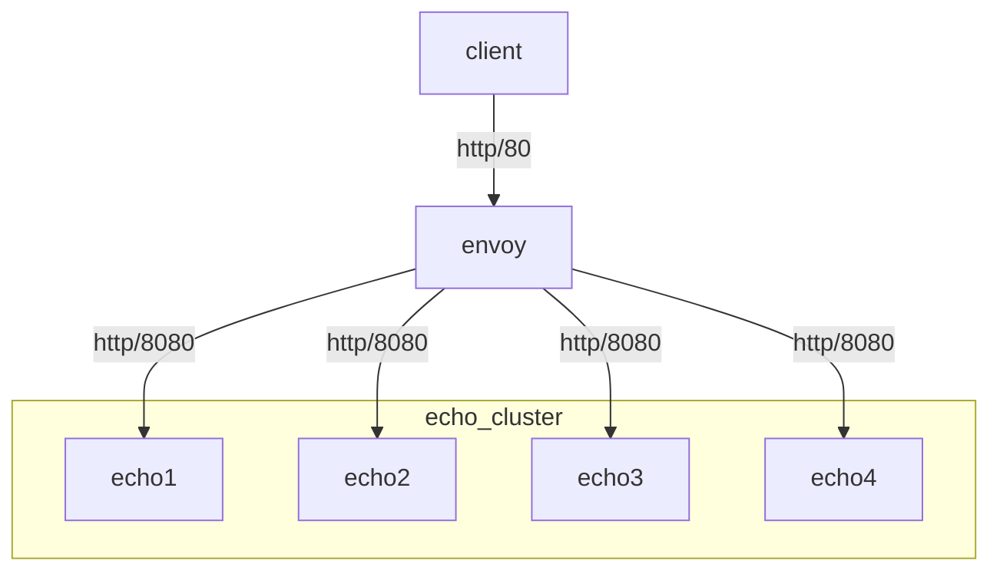

# Using statically defined backends



1. Start Docker containers
    ```command
    % docker compose up -d
    ```
1. Verify Envoy static cluster is added from `static_resources`
    ```command
    % curl -sSLD/dev/stderr http://localhost:9901/clusters | grep added_via_api
    HTTP/1.1 200 OK
    content-type: text/plain; charset=UTF-8
    cache-control: no-cache, max-age=0
    x-content-type-options: nosniff
    date: Tue, 21 Nov 2023 11:23:02 GMT
    server: envoy
    transfer-encoding: chunked

    echo::added_via_api::false
    ```
1. View Envoy listeners
    ```command
    % curl -sSLD/dev/stderr http://localhost:9901/listeners
    ```
1. View Envoy clusters (aka backends)
    ```command
    % curl -sSLD/dev/stderr http://localhsot:9901/clusters
    ```
1. Cleanup Docker containers
    ```command
    % docker compose down --remove-orphans --volumes --rmi local
    ```
