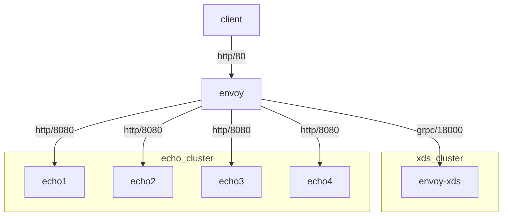

# Using gRPC Envoy xDS

[Example xDS gRPC server used here is from envoyproxy/go-control-plane](https://github.com/envoyproxy/go-control-plane/tree/main/internal/example)



1. Verify `xds_cluster` is defined from `static_resources` and `echo_cluster` cluster is added via xDS
    ```command
    % curl -sSLD/dev/stderr 0:9901/clusters | grep added_via_api
    HTTP/1.1 200 OK
    content-type: text/plain; charset=UTF-8
    cache-control: no-cache, max-age=0
    x-content-type-options: nosniff
    date: Tue, 21 Nov 2023 12:11:31 GMT
    server: envoy
    transfer-encoding: chunked

    echo_cluster::added_via_api::true
    xds_cluster::added_via_api::false
    ```
